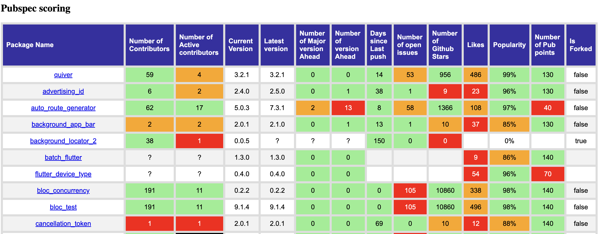

A Dart script to score libraries referenced in a given pubspec.lock. it generates an html file with some information about the lib. The rating is highlighted by colors (green, orange, red, black). Scoring is based on the following scale:

|            Scoring            | high (green) | moderate (orange) | low (red) | minimal (dark red) |
| :---------------------------: | :----------: | :---------------: | :-------: | :----------------: |
|    Number of Contributors     |     >=5      |        <5         |    <2     |         0          |
| Number of Active contributors |     >=5      |        <5         |    <2     |         0          |
| Number of Major version Ahead |      0       |         1         |     2     |        >=3         |
|    Number of version Ahead    |     <=2      |        >2         |    >10    |        >15         |
|     Days since Last push      |     <=90     |        >90        |   >365    |      > 2*365       |
|     Number of open issues     |     <=30     |        >30        |   >100    |         -          |
|    Number of Github Stars     |    >=100     |       <100        |    <10    |         -          |
|             Like              |    >=1000    |       <1000       |   <100    |         -          |
|          Popularity           |    >=90%     |       <90%        |   <70%    |         -          |
|     Number of Pub points      |    >=120     |       <120        |    <90    |         -          |


This is an example of what looks like the generated html.
		



## Quick Start 🚀

### Installing 🧑‍💻

```sh
dart pub global activate score_pubspec
```

### Commands ✨

The command requires to define env variable GITHUB_TOKEN thats represents token to make request on gitlab api. 
### `score_pubspec`


#### Usage

```sh
# score pubspec.lock in the current directory
score_pubspec 

# score the given file with path argment
score_pubspec --path 'path-to-pubspec.lock'


# score only direct dependencies and skip the transitive ones
score_pubspec --only-direct-spec

```